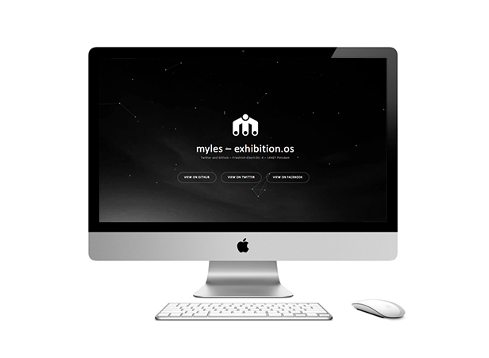

# myles.systems - design assets v.03

#### www.myles.systems


## Example and easy testing

die einfachste möglichkeit die aktuelle version zu testen ist einen 
http server im root der repo im entsprechenden branch (v0.2) zu starten.

step-by-step:

```
#open a terminal window with git and python and cd to the repo root
cd /your/path/to/repo/root/

#start a simple python http server to see the site
python -m SimpleHTTPServer 8000

#now you can open a browser with 
#localhost:8000/  and see the changes.
```

## Copyright and License:

HTML Code:
Copyright 2013-2015 Iron Summit Media Strategies,
LLC. Code released under the Apache 2.0 license.

Particle Biblothek:
http://www.cssscript.com/custom-particles-animation-javascript-canvas-particler/

Video-Background Biblothek:
https://rishabhp.github.io/bideo.js/


